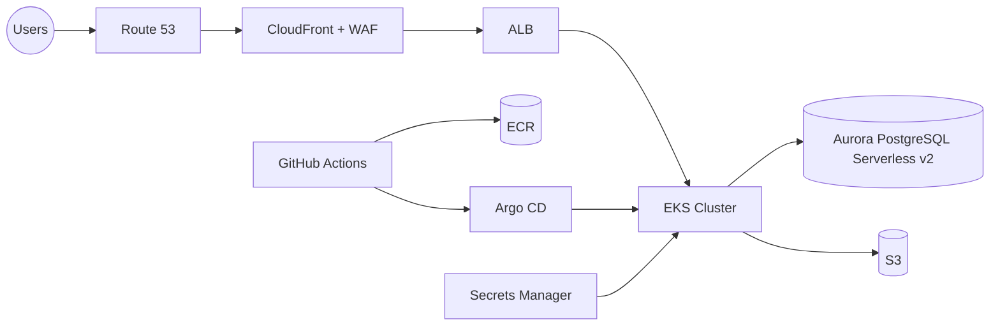

# EKS + Karpenter (x86 & Graviton) – POC

A minimal, production-leaning proof-of-concept that:
- Creates a dedicated VPC
- Provisions an EKS cluster (version configurable; defaults to 1.30 here)
- Installs **Karpenter** via Helm
- Sets up **two NodePools** (x86/amd64 and arm64/Graviton) using **EC2NodeClass**
- Demonstrates how a developer can schedule a workload onto either architecture

## Getting Started
1. Install prereqs: Terraform >= 1.7, AWS CLI, kubectl.
2. Configure AWS credentials and set your default region.
3. Create `terraform.tfvars` from the example:
   ```hcl
   project       = "acme"
   environment   = "dev"
   region        = "us-east-2"
   az_count      = 2
   k8s_version   = "1.30"
   cidr_block    = "10.50.0.0/16"
   public_subnets  = ["10.50.0.0/20", "10.50.16.0/20"]
   private_subnets = ["10.50.32.0/20", "10.50.48.0/20"]
   ```
4. Deploy:
   ```bash
   terraform init
   terraform apply -auto-approve
   aws eks update-kubeconfig --name $(terraform output -raw cluster_name) --region $(terraform output -raw region)
   kubectl get pods -n karpenter
   ```
5. Try workloads:
   ```bash
   kubectl apply -f samples/deploy-amd64.yaml
   kubectl apply -f samples/deploy-arm64.yaml
   kubectl get nodes -o wide
   ```

## How devs target CPU architecture
- x86: `nodeSelector: { kubernetes.io/arch: amd64 }`
- Graviton: `nodeSelector: { kubernetes.io/arch: arm64 }`

## Notes
- For production, copy the latest Karpenter controller IAM policy from upstream for the exact version deployed.
- Consider EventBridge interruption handling for Spot.
- Least-privilege IAM: narrow policies and use specific resource ARNs where practical.
- You can switch `amiFamily` to `Bottlerocket` in the `EC2NodeClass` spec.

---------------------------------------------------------------------------------------------------------------------------------------------------------------------------------------------------


# Innovate Inc. – Cloud Infrastructure Overview

## 📌 Overview
Innovate Inc. is launching a **React SPA + Python/Flask REST API** web application with a **PostgreSQL** backend.  
This design outlines a **secure, scalable, and cost-effective AWS architecture** leveraging **Amazon EKS** for managed Kubernetes and following cloud and DevOps best practices.

---

## 🌐 Cloud Environment
- **AWS Organizations** with separate accounts for:
  - `shared-services` – CI/CD, centralized ECR, logging
  - `dev` – development workloads
  - `staging` – pre-production testing
  - `prod` – production workloads
- **IAM Identity Center (SSO)** for workforce access
- **Least privilege IAM** with OIDC (IRSA) for Kubernetes service accounts

---

## 🏗 Network Design
- **Dedicated VPC** per environment with **3× AZs**
- **Subnet tiers**:
  - **Public** – ALB, NAT Gateways
  - **Private App** – EKS worker nodes
  - **Private Data** – Aurora PostgreSQL
- **Security**:
  - AWS WAF + CloudFront for edge protection
  - Security Groups as primary network boundary
  - VPC Endpoints for private AWS service access

---

## ⚙️ Compute Platform (EKS + Karpenter)
- **Amazon EKS** with namespaces per service
- **Ingress** via AWS Load Balancer Controller (ALB)
- **Karpenter** for just-in-time autoscaling:
  - **amd64** node pool (x86 workloads)
  - **arm64** node pool (Graviton for cost/performance)
- **Pod scaling** with HPA + resource quotas
- **Secure container builds**:
  - Multi-stage Docker builds
  - Images stored in Amazon ECR with vulnerability scanning

---

## 🗄 Database (Aurora PostgreSQL Serverless v2)
- **Multi-AZ** for high availability
- **Elastic scaling** to handle traffic bursts
- **Backups & DR**:
  - Automated backups + point-in-time recovery
  - Optional cross-region replica for disaster recovery
- **Secure access** via private subnets & AWS Secrets Manager

---

## 🚀 CI/CD Workflow
- **GitHub Actions** for build/test
- **Docker image push** to ECR
- **Argo CD (GitOps)** for automated environment sync
- **Terraform** for IaC with remote state in S3 + DynamoDB lock table

---

## 📊 Observability
- **Logging**: Fluent Bit → CloudWatch Logs
- **Metrics**: Prometheus (AMP) + Grafana
- **Tracing**: AWS Distro for OpenTelemetry → X-Ray
- **Alerts**: CloudWatch Alarms → Slack/PagerDuty

---

## 🔐 Security Highlights
- TLS 1.2+ everywhere
- AWS WAF + OWASP rule sets
- GuardDuty, Security Hub, CloudTrail org trails
- Encryption at rest (KMS) and in transit
- Pod Security Admission + Network Policies

---

## 📈 Scalability Approach
- Minimal static nodes for system add-ons
- On-demand Karpenter nodes for application workloads
- Aurora PostgreSQL auto-scaling with low capacity floor

---

## 🖼 High-Level Diagram

